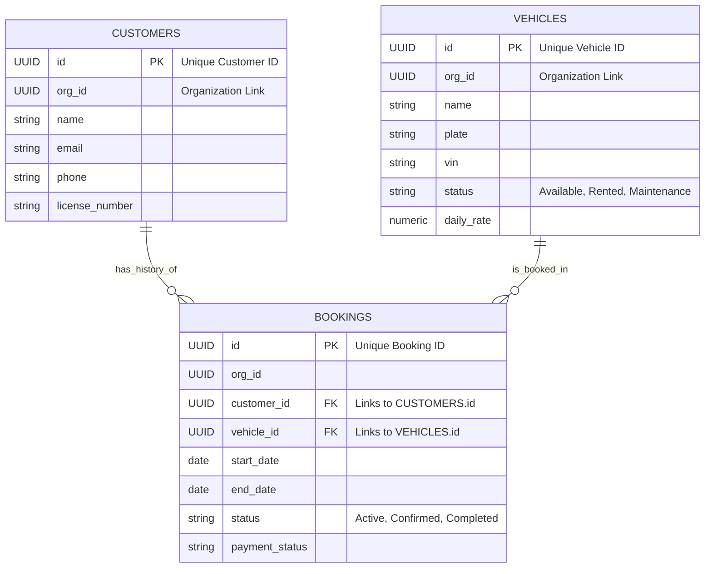

# Database Schema Relationships

This diagram illustrates how the `bookings` table connects your `vehicles` and `customers` data.

- **Central Entity**: The `BOOKINGS` table acts as the junction, linking a specific Customer to a specific Vehicle for a duration.
- **Relationships**:
  - One **Customer** can have **Many** Bookings (One-to-Many).
  - One **Vehicle** can appear in **Many** Bookings over time (One-to-Many).

## detailed Explanation

1.  **Foreign Keys**:
    *   `bookings.customer_id` $\rightarrow$ `customers.id`: This ensures every booking is attached to a valid profile.
    *   `bookings.vehicle_id` $\rightarrow$ `vehicles.id`: This ensures you can't book a vehicle that doesn't exist.

2.  **Organization Scoping**:
    *   All three tables (`customers`, `vehicles`, `bookings`) contain an `org_id`. This is critical for your multi-tenant (or multi-org) setup, ensuring that a user only sees data belonging to their specific fleet organization.
